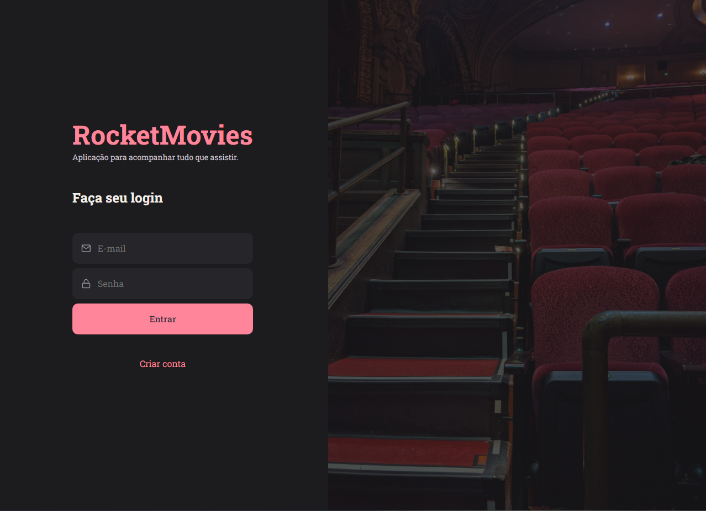

<h1 align="center"> RocketMovies </h1>

<p align="center">
  <a href="#-tecnologias">Tecnologias</a>&nbsp;&nbsp;&nbsp;|&nbsp;&nbsp;&nbsp;
  <a href="#-projeto">Projeto</a>&nbsp;&nbsp;&nbsp;&nbsp;&nbsp;&nbsp;</a>
</p>

<br>

<p align="center">
  
</p>

## 🚀 Tecnologias

Esse projeto foi desenvolvido com as seguintes tecnologias:

- HTML5 
- CSS3 
- JavaScript
- Github
- Vite
- React
- Figma

## 💻 Projeto

Projeto RocketMovies! Este projeto web desenvolvido com React e Vite para descobrir e explorar informações sobre filmes.

O RocketMovies é uma aplicação que nos permite salvar dentro de nossas contas anotações e notas para cada filme que já assistimos.

Podemos pesquisar por detalhes de cada filme, notas, sinopse e título.


## 🔖 Layout

Você pode visualizar o layout do projeto através [DESSE LINK](https://www.figma.com/design/U1lulSLOCATok4s8ogEAML/RocketMovies-(Copy)?t=EexiHJbNjTp6k5qZ-0) É necessário ter conta no [Figma](https://figma.com) para acessá-lo.

## : Licença

Esse projeto está sob a licença MIT.


## Como Executar Localmente ▶️

1. Clone este repositório:
```bash
git clone https://github.com/RocketMovies.git
cd RocketMovies
```
2. Instale as dependências:
```bash
npm install
```
4. Inicie a aplicação:
```bash
npm run dev
```
---

Deploy:
  [Clicque aqui para acessar o Projeto!](https://rocket-movies-x.vercel.app/)


By Thiago Caetano :wave: 
  [LinkedIn](https://www.linkedin.com/in/caetanosbr/) 
  
  [GitHub](https://github.com/caetanosbr)
  
---